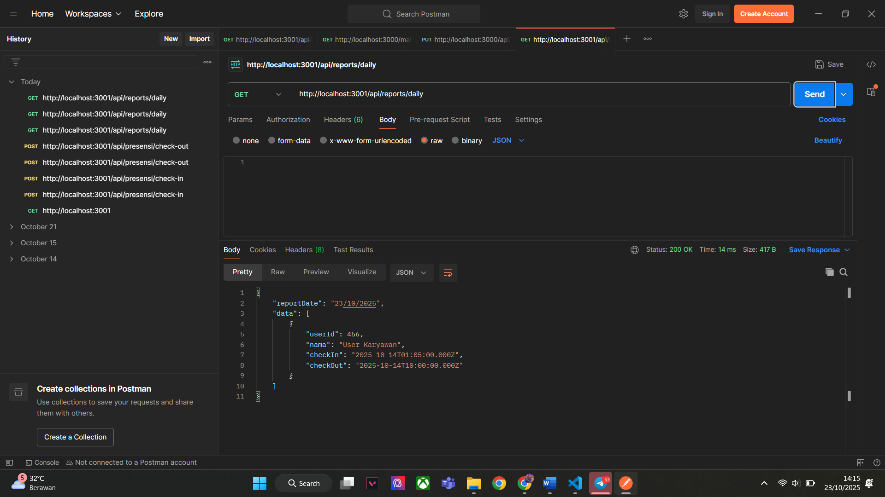
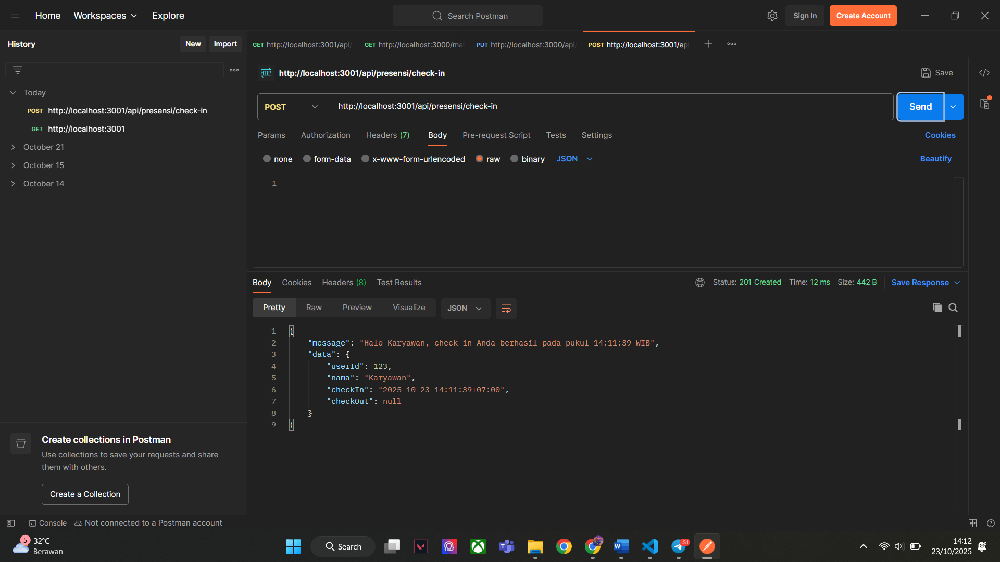
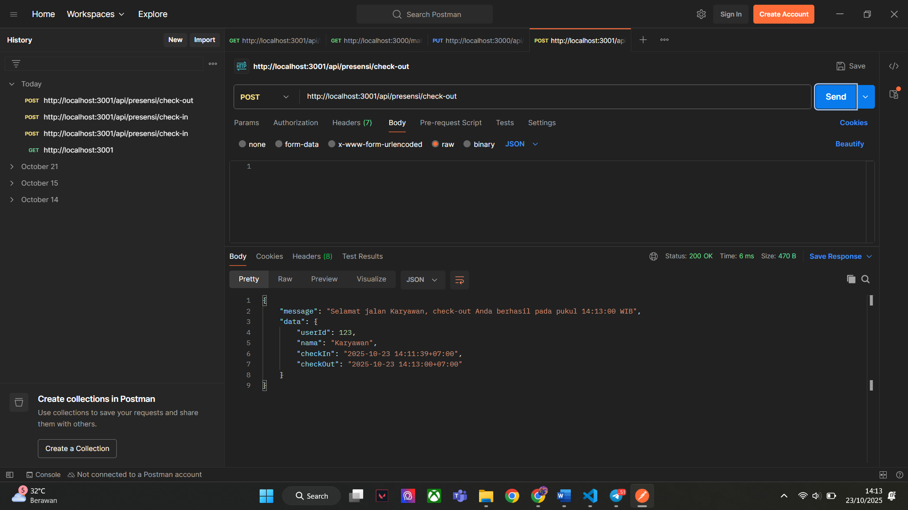
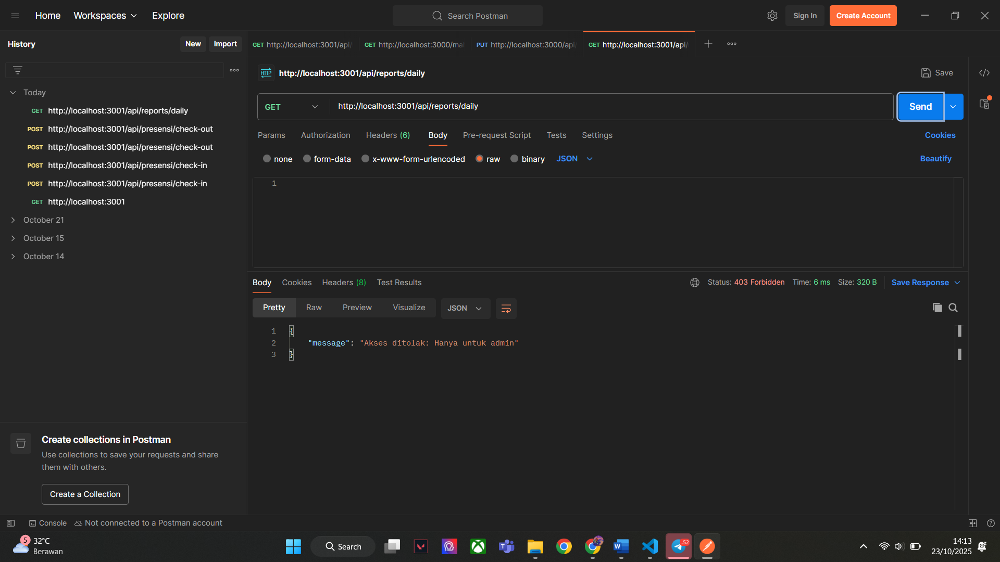

| No | Skenario | Deskripsi | Screenshot |
|----|-----------|------------|-------------|
| 1 | **Login Admin** | Menguji endpoint login untuk akun admin dengan kredensial yang valid. |  |
| 2 | **Check-in** | Karyawan melakukan check-in pertama kali pada hari tersebut. |  |
| 3 | **Check-in Lebih dari 1 Kali** | Menguji validasi ketika karyawan mencoba check-in dua kali dalam satu hari. |  |
| 4 | **Check-out** | Karyawan melakukan check-out dengan data check-in yang valid. |  |
| 5 | **Check-out Tanpa Check-in** | Menguji kondisi ketika pengguna mencoba check-out tanpa melakukan check-in terlebih dahulu. |  |
| 6 | **Login Karyawan** | Menguji endpoint login untuk akun karyawan. |  |
